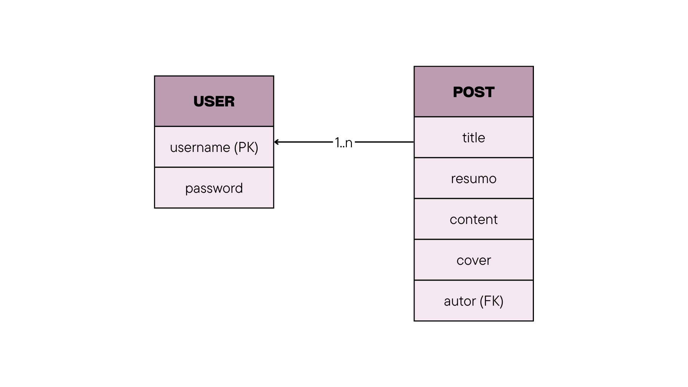

# **CSI606-2024 - Presencial - Proposta de Trabalho Final**

## *Aluna(o): Daniele Almeida*

--------------

### Resumo

### 1. Tema

  A aplicação web desenvolvida tem como objetivo ser um blog simples para realizar o compartilhamento de receitas entre os usuários. Como um caderno de receitas virtual.

### 2. Escopo

  Funcionalidades da aplicação:
  Usuários:
  - Cadastro de usuários;
  - Login de usuários;
  - Autenticação dos usuários.
  Posts:
  - Cadastro de posts;
  - Edição de posts;
  - Exclusão de posts;
  - Visualizar posts cadastrados pelo usuário.

### 3. Restrições

  - Não é possível visualizar o perfil dos usuários e nem configurar detalhes do perfil.

### 4. Protótipo

  O diagrama entidade-relacionamento possui duas entidades: User e Post.

  #### User: 
  A entidade User representa os usuários do sistema, que podem criar posts.

  Atributos:
  - username: É a chave primária (PK) que identifica cada usuário. 
  - password: É uma string obrigatória que armazena a senha do usuário.

  #### Post:
  Representa as publicações feitas pelos usuários.

  Atributos:
  - title: Armazena o título do post.
  - resumo: Resumo do conteúdo do post.
  - content: Conteúdo principal do post.
  - cover: Imagem de capa do post.
  - autor: Chave estrangeira (FK) que referencia o _id de um usuário em User. Cada post está associado a um único autor.

  
  

  Foram construídas as seguintes páginas:

  - Página inicial do blog

  Usuário:
  - Cadastro
  - Login

  Posts:
  - Criar posts
  - Editar posts
  - Post

  As páginas podem ser encontradas em: \Projeto\client\src\pages

### 5. Referências

  #### Ferramentas utilizadas:
  - REACT.JS. React.js: The library for web and native user interfaces. Página inicial. Disponível em: https://react.dev/
  - NODE.JS. Node.js: Node.js® is a JavaScript runtime built on Chrome's V8 JavaScript engine. Página inicial. Disponível em: https://nodejs.org/pt
  - EXPRESS.JS. Express.js: Framework web rápido, flexível e minimalista para Node.js. Página inicial. Disponível em: https://expressjs.com/pt-br/
  - MONGODB. MogoDB:Get your ideas to market faster with a developer data platform built on the leading modern database. Página inicial. Disponível em: https://www.mongodb.com/pt-br
  - JWT. JWT: JSON Web Token (JWT) is a compact URL-safe means of representing claims to be transferred between two parties. Página inicial. Disponível em: https://jwt.io/

  #### Bibliotecas utilizadas no projeto:
  - REACT QUILL. React Quill: The Quill rich-text editor as a React component. Disponível em: https://classic.yarnpkg.com/en/package/react-quill
  - DATE-FNS. Date-fns: Modern JavaScript date utility library. Disponível em: https://classic.yarnpkg.com/en/package/date-fns
  - MULTER. Multer: Multer is a node.js middleware for handling multipart/form-data, which is primarily used for uploading files. Disponível em: https://classic.yarnpkg.com/en/package/multer

  #### Ícones utilizados no projeto:
  - HEROICONS. Heroicons: Beautiful hand-crafted SVG icons, by the makers of Tailwind CSS. Página inicial. Disponível em:https://heroicons.com/
